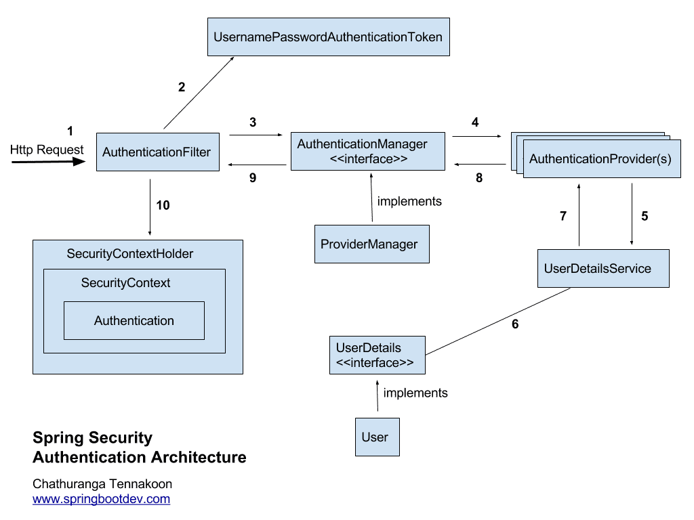

# Spring Security

### 스프링 시큐리티

스프링 시큐리티는 스프링 기반의 애플리케이션의 보안을 담당하는 스프링 하위 프레임워크이다. 스프링 시큐리티는 인증과 권한에 대한 부분을 Filter 흐름에 따라 처리한다. 보안과 관련해서 체계적으로 많은 옵션을 제공해 주기 때문에 개발자 입장에서는 직접 보안 관련 로직을 작성하지 않아도 된다는 장점이 있다.

#

### 인증 (Authentication), 인가 (Authorization)

- 인증 (Authentication)

  인증은 어떤 개체(사용자 또는 장치)의 신원을 확인하는 과정이다.
  스프링 시큐리티는 username 과 password를 이용하는 credential 인증 방식을 사용한다.

- 인가 (Authorization)

  인가는 어떤 어떤 개체(사용자 또는 장치)가 접근을 요청할 때 접근 권한이 있는지 확인하는 과정이다.

#

### Filter

사용자의 요청이 Servlet에 도달하기 전에 미리 전처리를 해주거나 사용자에게 전달되는 응답에 후처리를 하는 역할을 담당한다.

### 스프링 시큐리티 처리 과정

1. 사용자가 로그인을 하기 위한 요청을 보낸다.

2. AuthenticationFilter가 유효성 검사를 하고 검사가 끝나면 아이디와
   비밀번호를 기반으로 UserPasswordAuthenticationToken을 발급한다.

3. UserPasswordAuthenticationToken을 AuthenticationManager에게 전달한다.

4. AuthenticationManager는 전달받은 UsernamePasswordToken을 순차적으로 AuthenticaionProvider들에게 전달한다.

5. AuthenticationProvider에서 사용자 아이디를 조회하고 아이디를 UserDetailsService로 전달한다.

6. UserDetailsService는 사용자 아이디로 찾은 사용자 정보를 DB에서 찾아 UserDetails 객체로 만든다.

7. 만들어진 UserDetails 객체를 AuthenticationProvider에 전달한다.
   AuthenticationProvider는 전달받은 UserDetails 객체와 입력 정보를 비교해 실제 인증 처리를 한다.

8. 인증이 완료되면 Authentication 객체를 AuthenticationManager에게 반환한다.

9. Authentication 객체를 AuthenticationFilter에게 반환한다.

10. AuthenticationFilter 가 Authentication 객체를 SecurityContextHolder에 저장한다.
